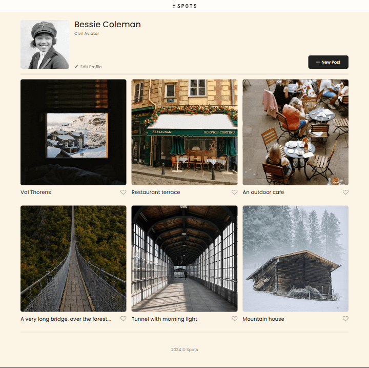
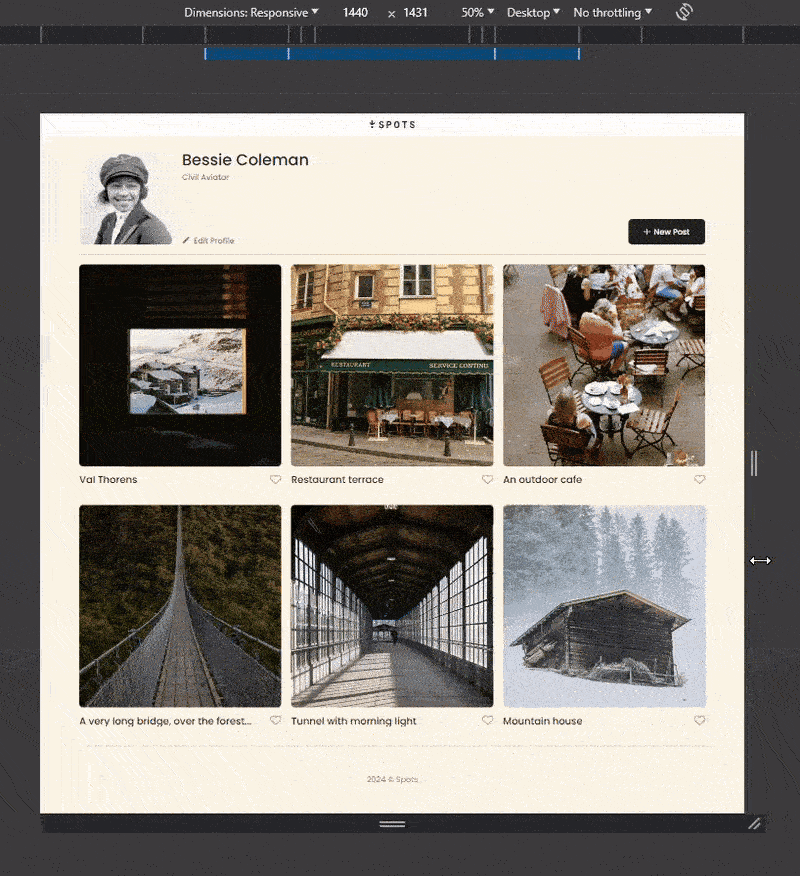

https://anthonylynn.github.io/se_project_spots/

# Project 3: Spots

### Overview

- Intro
- Figma
- Images

**Intro**

A website project for the TripleTen coursework, specifically sprint 3. It features a theoretical site where users would see different pictures posted by a user and the user's profile.

The site uses different display types, such as flex and grid. It has a responsive layout that can be viewed from sizes larger than 320px with relative sizes and media queries.

**Figma**

- [Link to the project on Figma](https://www.figma.com/file/BBNm2bC3lj8QQMHlnqRsga/Sprint-3-Project-%E2%80%94-Spots?type=design&node-id=2%3A60&mode=design&t=afgNFybdorZO6cQo-1)

**Images**

Page:

Responsive Layout:

**Feature Video**

https://youtu.be/GYTr2iD7Q6M
